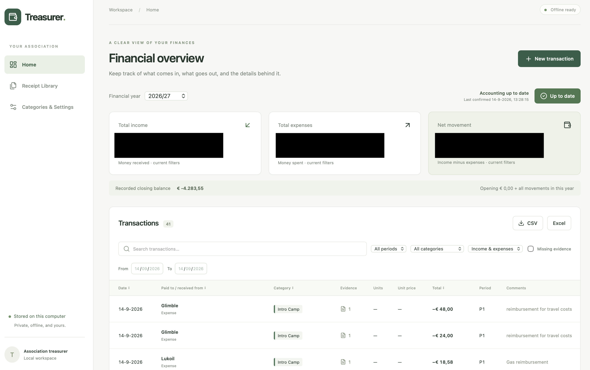
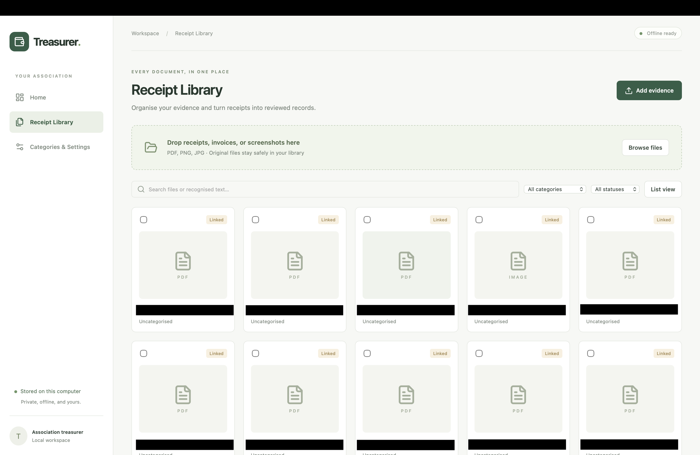
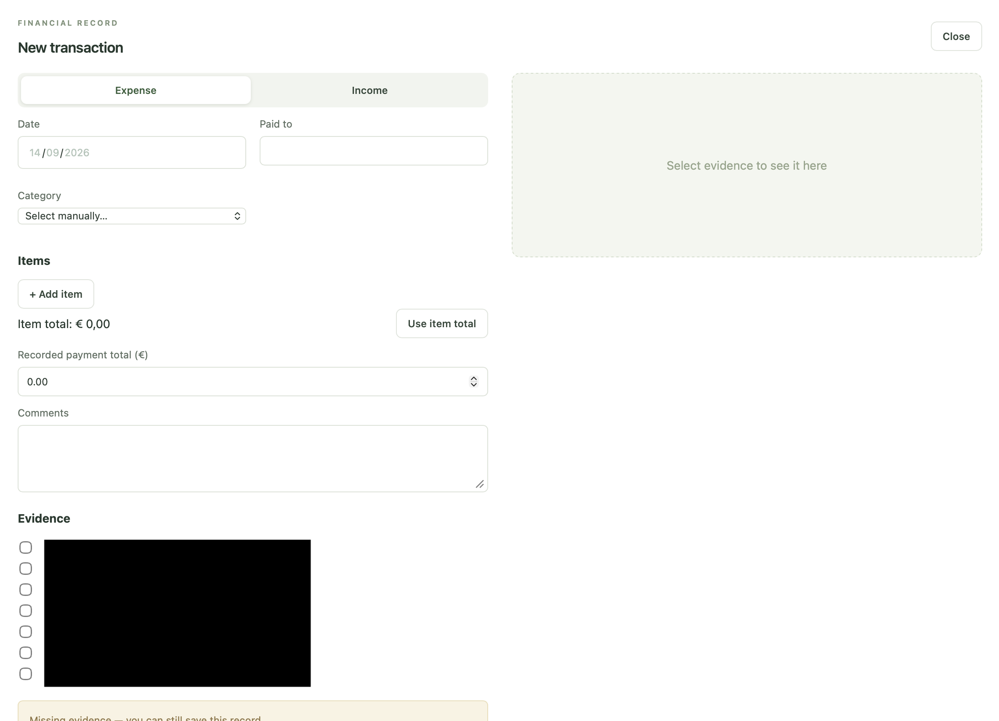
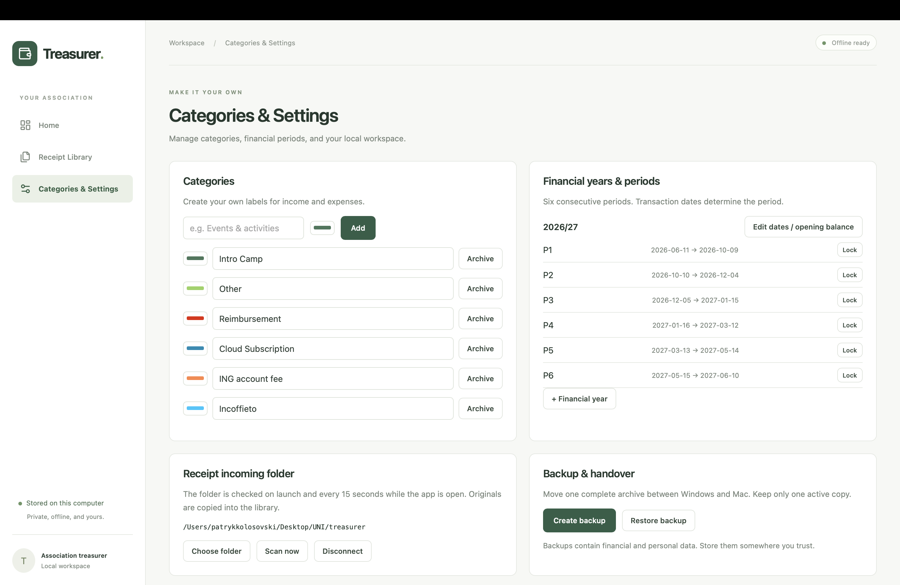

<div align="center">

# Treasurer.

### Your association’s finances, receipts, and handover — in one local workspace.

A desktop app built for the everyday work of a Dutch student association treasurer.
Track money in and out, keep the evidence behind each transaction, and prepare the next handover.

**Offline by design · Local storage · Dutch & English OCR**

[Explore the demo](#a-tour-of-treasurer) · [Run locally](#run-locally) · [Read the guide](docs/guide.md)

</div>



## A clear view of the books

Treasurer brings financial records and their supporting documents together. Review the year, find a payment, check its receipt, and export the records you need without switching between scattered folders and spreadsheets.

| Everyday task | How Treasurer helps |
| --- | --- |
| Understand the finances | Income, expenses, net movement, and a recorded closing balance in one overview. |
| Find a transaction | Search and filter by year, period, category, type, date, or missing evidence. |
| Organise receipts | A searchable library for PDFs, PNGs, and JPEGs, linked to financial records. |
| Reduce manual entry | Local Dutch and English OCR suggests values for review against the source. |
| Prepare reports | Export the filtered transaction list to CSV or Excel. |
| Hand over the role | Create a full backup containing the workspace and original evidence files. |

## A tour of Treasurer

### 1. Start with the financial overview

Choose a financial year to see its records and totals. Narrow the list to a period or category, check transactions without evidence, and mark the books **Up to date** after reconciliation. The latest confirmation stays visible the next time you open the app.

*The overview above shows the main workspace. Black bars in the supplied screenshots are existing redactions.*

### 2. Bring the evidence together

Drop receipts, invoices, or screenshots into the **Receipt Library**, or browse for files. Search filenames and recognised text, filter the library, and see which documents are linked to records. Originals remain in the local library.



An optional incoming folder is checked on launch and every 15 seconds while the app is open. Local OCR helps turn documents into reviewed records; uploading a receipt alone does not create a financial movement.

### 3. Record the payment and its details

Create an income or expense record with a date, counterparty, category, item lines, payment total, and comments. Attach supporting evidence and preview it alongside the form. Missing evidence is flagged so you can return to it later.



### 4. Make the workspace fit your association

Create colour-coded categories, configure a financial year with six consecutive periods, set the opening balance, and lock completed periods. Choose an incoming receipt folder and create or restore a backup from the same settings screen.



## Run locally

The native desktop app provides persistent records, evidence access, and backups. Install Node.js 22+, Rust stable, and the platform build tools described in the [setup guide](docs/guide.md#run-and-build).

```sh
git clone https://github.com/patrykkolosovski-lab/AccountingAssistant.git
cd AccountingAssistant
npm ci
npm run assets
npm run desktop
```

The asset step downloads missing Dutch and English OCR language files. Once prepared, recognition runs locally without a network connection.

For a visual browser preview, run `npm run dev`. The browser preview cannot persist records or access desktop evidence.

To create a native installer on your host platform:

```sh
npm run bundle
```

Intended targets are Windows 10/11 x64 and macOS 12+ on Intel and Apple Silicon. Builds are unsigned; platform setup and installation notes are in the [guide](docs/guide.md#run-and-build).

## Built to stay local

- **No cloud account or subscription.** The workspace uses a local SQLite database and stores original evidence in the operating system’s app-data directory.
- **Recognition stays on the computer.** PDF.js handles PDF text and rendering; Tesseract.js performs Dutch and English OCR. Suggested values need human review.
- **Backups support handover.** Full archives preserve application state and originals. Report exports do not replace backups.

Backups are not encrypted. Keep them on trusted storage and maintain one active workspace when transferring between computers. See [data and backups](docs/guide.md#data-and-backups) and [recognition limitations](docs/guide.md#recognition-limitations) for details.

## Under the hood

| Layer | Technology |
| --- | --- |
| Interface | React 19, TypeScript, Vite, Lucide icons |
| Desktop runtime | Tauri 2 and Rust |
| Storage | SQLite via rusqlite and local evidence files |
| Document processing | PDF.js and Tesseract.js |
| Spreadsheet handling | SheetJS |
| Financial arithmetic | Decimal.js |
| Verification | Vitest, Playwright, and Rust tests |

Run the core checks with:

```sh
npm test
npm run build
cargo test --manifest-path src-tauri/Cargo.toml
```

The [desktop build workflow](.github/workflows/build.yml) builds Windows, Apple Silicon, and Intel Mac targets. The [operating and development guide](docs/guide.md) covers first use, exports, backup behaviour, and native release acceptance checks.
